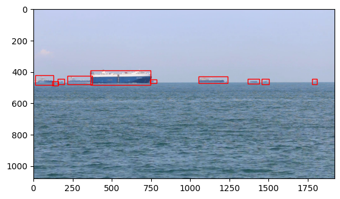

# Deep-learning-in-Maritime-applications
深度學習於海事應用_基於深度學習之新加坡海事資料集模型應用

[資料集下載連結](https://nkusto365-my.sharepoint.com/:f:/g/personal/c110181103_office365_nkust_edu_tw/EjBdu-lgFYBOmtXpTpgGuUsBNA0WD5iMtEJBhjsFESu4Cg)

## Citing

1. D. K. Prasad, D. Rajan, L. Rachmawati, E. Rajabaly, and C. Quek, “Video Processing from Electro-optical Sensors for Object Detection and Tracking in Maritime Environment: A Survey,” *IEEE Transactions on Intelligent Transportation Systems*, vol. 18, no. 10, pp. 2591-2608, Oct. 2017.

2. Tilemachos Bontzorlos, "Singapore Maritime Dataset trained Deep Learning models," GitHub repository, [Online]. Available: [https://github.com/tilemmpon/Singapore-Maritime-Dataset-Trained-Deep-Learning-Models](https://github.com/tilemmpon/Singapore-Maritime-Dataset-Trained-Deep-Learning-Models). Accessed: [2025/01/10].
